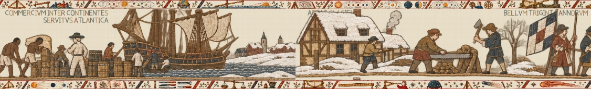
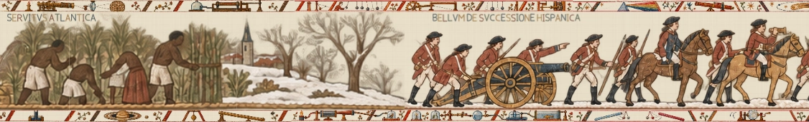
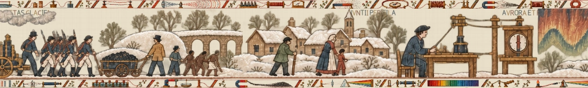

# Stable drawing height and muted wool

The 3 October review identified central illustration height steps near 1600, 1700 and 1835, despite level outer borders. The source drawings occupied different pixel heights. Drawing them with a shared pixel multiplier made later scenes visibly shorter.

Every complete narrative band now fits proportionally into the same drawing envelope. Horizontal and vertical scale remain equal; source crops include complete figures, trees and ground lines. This fit depends on the fixed context height, never the zoom level. Zoom still exposes and conceals the same cloth pixels. Both scientific borders retain one continuous depth across all narrative joins.

The four active narrative masters were redrawn against `images/tapestry/style-reference-bayeux.png`, with flat wool contours, faded madder, subdued slate-indigo, ochre and undyed thread. Transparent threadwork lies over one continuous linen ground. The native linen renderer uses uneven flax strands and occasional slubs, replacing the regular grid texture.

The twelve chronological sections preserve the existing event identities and dates. The 1682 and 1758–59 comet observations, Carrington's telegraph disruption, the trench approach and the barren lunar surface remain depicted. Latin still sits beneath the illustration on transparent linen. All three context modes retain their shared whole-area height.

Exact built-in image generation and edit prompts are recorded in `images/tapestry/muted-embroidery-prompts.json`. Original masters, intermediate extraction inputs and all earlier generation history are retained and checked by `tools/linear-story-artwork.mjs`; WebP delivery files are lossless conversions of their PNG masters.

Review the actual composed cloth near each source join and at Fit, intermediate zoom and full opening. Generation sheets and automated checks alone do not establish visual approval. The governing requirements and exact review crops remain in [Context drawing instructions](context-drawing-instructions.html).

## Actual composed join previews

These images were exported from the running application canvas at full opening, with its maintained Latin and shared scientific borders. All three retained a 165-pixel context area in the same viewport.

Validation: 117 native tests, 30 prototype tests and the full desktop browser audit passed, including all three modes, folding, fixed height, canonical targets and printable research trail. The eight visually inspected locations were 1600, 1700, 1835, 1682, 1758, 1859, 1916 and 1969.

## Saved active artwork and prompts

Generated and edited with the built-in image generation tool. Active PNG masters (each has a lossless WebP sibling):

- [opening narrative](../images/tapestry/bayeux-linear-opening-faded-wool-threads.png)
- [early narrative](../images/tapestry/bayeux-linear-early-faded-wool-threads.png)
- [middle narrative](../images/tapestry/bayeux-linear-middle-faded-wool-threads.png)
- [modern narrative](../images/tapestry/bayeux-linear-modern-faded-wool-threads.png)

[Exact ten generation and edit prompts](../images/tapestry/muted-embroidery-prompts.json) include each input reference and output path; [the generation record](../images/tapestry/linear-story-generation.json) retains their hashes and complete earlier history.
