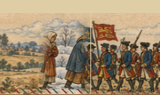
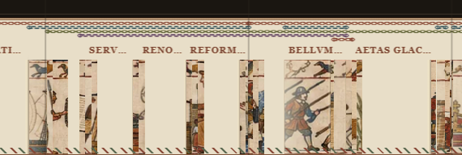
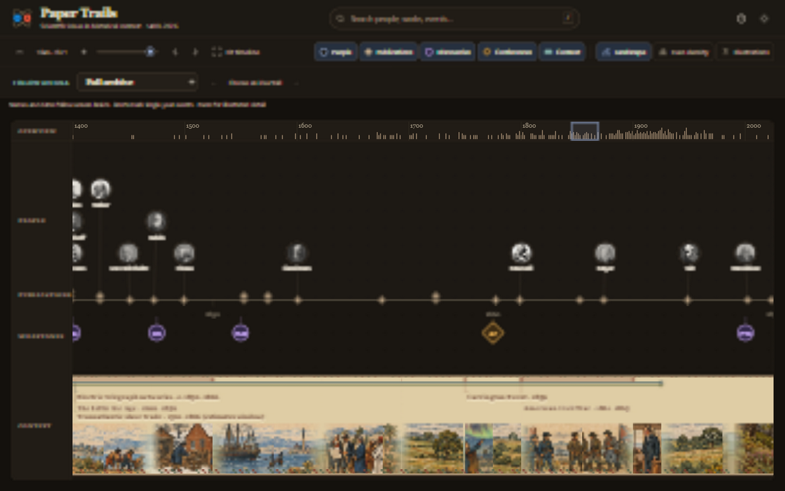
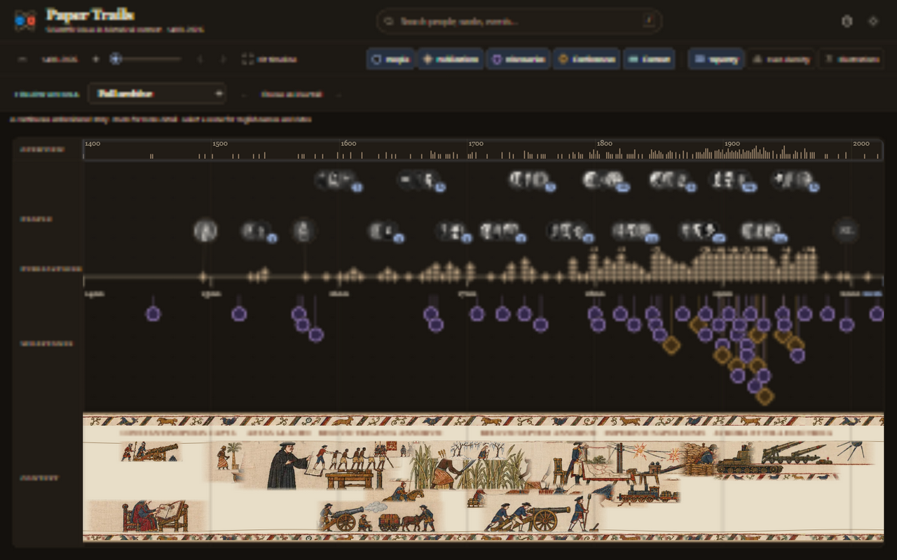

# Second UI pass · review notes

Recorded 1 October 2026 from the user's first review of the published prototype.

Review site: https://lusty-tundra-re5d.here.now/

Reviewed baseline: `prototype/ui-pass2`, commit `b7513e3b024ca0d6951955014bd6cdd3d6fd511e`.

These are open findings and agreed design directions for subsequent polish passes. No fixes are claimed by this record. The user's latest direction below takes precedence over earlier proposals for empty linen gaps and braids in Tapestry mode.

## 1. Responsiveness

The site feels sluggish, particularly at startup and when switching between Tapestry, Landscape and Bars.

Investigate both initial loading and the work performed on each mode switch. Measure before choosing a remedy; no root cause has been established. Aim for prompt feedback and smooth interaction, including repeated switches after the artwork has already loaded.

## 2. Landscape joins and vertical lines

Some transitions between landscape scenes are rough, with odd vertical lines visible through the artwork. Improve continuity at scene joins and remove unintended seams. Check the result at different zoom levels and while panning.

## 3. Tapestry as a continuous, overlapping story

The current display breaks into thin picture fragments separated by large gaps. Key subjects should remain recognisable and form a continuous narrative, with events weaving together where their historical periods overlap.

Use judgement to give the important moments enough visual presence: snow and cold periods, Napoleon, steam engines, cannons, tanks, trenches and the space race. Compose overlapping events together rather than allowing one to erase another or leaving disconnected strips. Preserve the recorded chronology and readable event identity while improving the composition.

Restore the animal borders from the agreed [Bayeux facsimile study](bayeux-style-studies/08-bayeux-facsimile.png). Keep that study as the visual reference: wool contours and fills on linen, recognisable figures and machinery, and continuous upper and lower borders with animals, birds and ornament.

Braids may be removed from **Tapestry** mode to make room for the narrative and animal borders. Keep the braids in **Landscape** mode.

**Confirmed zoom behaviour:** show a continuous, recognisable overview when zoomed out, revealing more detail as the user zooms in. Narrow picture fragments and large gaps must not replace the overview story. Preserve the original fixed-picture folds: they conceal and reveal the same drawing, without distortion, sliding or picture swaps, and open fully at maximum zoom. The previous sentence suggesting the overview could supersede folding was an assistant interpretation, explicitly rejected by the user on 1 October.

## 4. Give context text room

There is ample space for the text; it should not be unnecessarily constrained or truncated. Use the available space for readable labels and fuller wording. Explore an elegant visual connection between the text and its corresponding braid in Landscape mode, so overlapping periods remain easy to identify.

**Confirmed language treatment:** Landscape shows readable English event names and dates linked to their braids. Tapestry keeps short Latin inscriptions in the agreed visual style, with English details available on selection.

Coordinate text placement with the continuous story and animal borders in Tapestry mode, without reintroducing braids solely to attach labels.

## 5. Match the height of Bars mode

Resize the Tapestry and Landscape displays so both match the **total context area height** of the Bars display, including artwork, borders and labels. Use Bars as the reference height when switching between the three context modes. Preserve artwork proportions and keep the tapestry's animal borders within that shared height; labels must also fit within it.

## 6. Carrington and the telegraph network

Show the Carrington Event together with the telegraph network it disrupted. Use their overlap to connect the aurora/solar-storm imagery with wires, poles and telegraph equipment within the illustrated story. Keep Carrington as the single 1859 event and retain the network's own historical interval and sources.

## Implementation stack

**Latest governing brief:** [Consolidated context requirements](ui-pass2-context-summary.html), reconstructed from the older settled conversations and this review. The layer descriptions below record implementation history; the user has since rejected the Tapestry's multirow motif composition and loss of folding. Passing checks and earlier source-sheet approval do not establish acceptance of that result.

All layers target `prototype/ui-pass2` through their preceding branch, with the existing hourly CodeRabbit review gate. The review site is updated only after the stack has passed review and landed.

1. `ui-pass2/17-context-performance`: one initial URL-aware render, detached timeline assembly and canvas-first artwork with SVG recovery.
2. `ui-pass2/18-context-height-joins`: use the Bars context area for every mode; remove unintended fold-edge stripes and improve landscape joins.
3. `ui-pass2/19-continuous-story`: a continuous readable tapestry overview, overlapping stories, key motifs, animal borders and Carrington alongside telegraph imagery.
4. `ui-pass2/20-context-labels-validation`: roomy English landscape labels with braid connections, Latin tapestry inscriptions, browser regression checks and deployment handoff.

Performance check for layer 17: a local baseline Bars-to-Landscape click occupied roughly 4.4 seconds of synchronous main-thread work. After the change, switches at 1440×900 measured 42 ms (Tapestry), 20 ms (Bars) and 34 ms (Landscape); a first switch at 1280×800 measured 68 ms. These are development-browser observations, not cross-device benchmarks or a claim that artwork download time is eliminated. All 81 native tests and 25 Python operator tests passed.

### Continuous story implementation (layer 19)

**Superseded Tapestry approach:** the user requires concurrent events to be drawn together in one depiction, on one continuous linear cloth that folds. Separate extracted motifs arranged on different baselines do not satisfy that instruction. Keep the Carrington/telegraph relationship and canonical dates while replacing the composition and restoring fixed-art folding.

Tapestry now composes complete identifying motifs on a single viewport canvas instead of projecting Landscape's narrow folded faces. Its continuous animal and bird borders use the approved Bayeux sheet. Climate scenes use the approved winter-era sources; overlapping events share baselines, with key subjects given precedence. Wider chronological room exposes further action groups from the same approved sources, preserving their proportions. The composition is symbolic; English selection details carry exact dates. Decorative border repetition does not duplicate historical events.

Carrington and electric telegraph networks use their approved wires/operators imagery together, with Carrington retained at 1859 and the network retaining its own 1830–1866 interval. Carrington's details now explain induced currents, sparks, operator shocks and messages carried with batteries disconnected, supported by [NASA Goddard, Cutting Edge, Winter 2012, page 3](https://www.nasa.gov/wp-content/uploads/2017/11/winter2012.pdf).

Validation: 86 Node tests and 25 Python tests; collaborative-browser overview and 1845–1871 detail inspection. Tapestry contains 25 accessible events and no duration braids. PNG fallback retries the same approved drawing when its WebP cannot load. Label spacing and broader interaction checks follow in layer 20.

### Label and regression implementation (layer 20)

Landscape English names and dates now use three measured rows and may borrow room beyond narrow event spans. Fine threads connect them to their real visible braids. Complete labels yield when those rows are full and return as zoom creates room; they are not ellipsised. Narrow screens wrap long names. Landscape fold clips now share physical pixel boundaries to reduce fractional seams, without shifting the dated braids. Tapestry's Latin text uses measured widths with priority for key scenes, and winter scenes have their own baseline behind the foreground story.

Validation: 89 Node tests and 25 Python operator tests passed; artwork provenance and the updated optional unattended browser-audit script passed their native/syntax checks. Browser verification for this pass used T3's collaborative preview: overview and detailed views, both date scales, mode cycles, maximum zoom, panning, 1440×900 and 390/320 px layouts, and keyboard selection of Carrington's English details. Full visible Landscape labels did not overlap or truncate, and each had a braid connector. The 320 px toolbar also wraps to avoid horizontal overflow.

At a fixed range, all three modes shared the same total context area, including labels and borders. At maximum zoom, Tapestry exposed 129 action groups while retaining all 25 events' recorded dates; panning kept their geometry stable. Context height may change with the Bars row requirements of a new range. Repeated local mode switches occupied 16–40 ms synchronously; network and decode times are separate.

The existing gated reviewer remains responsible for fresh-head review, fixes, restacking and merges into `prototype/ui-pass2`. The saved here.now review Site is refreshed after the full stack lands and its packaged artifact passes the publication checks.

